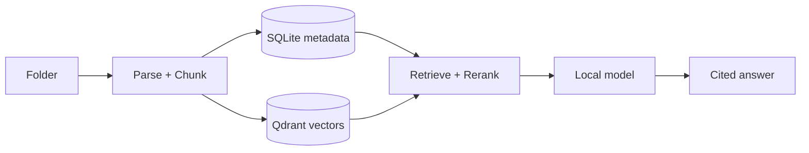

# DocFlow

English · [简体中文](README.zh-CN.md)

**Drop a folder. Ask anything. Keep it local.**

DocFlow is a local-first document Q&A and personal knowledge workspace. Point it
at a folder of PDFs, Markdown, DOCX, TXT, code-like files, or optional images.
Ask questions in the browser, inspect the cited sources, and save useful answers
back into your local knowledge loop.


The screenshots in this README are captured from the bundled demo library, not a personal vault.

<table>
  <tr>
    <td><strong>Local-first</strong><br>No telemetry, analytics, or document upload.</td>
    <td><strong>Cited answers</strong><br>Answers are tied back to source chunks and snippets.</td>
    <td><strong>Measured checks</strong><br>Regression tests, browser checks, parsing checks, and benchmark artifacts.</td>
  </tr>
</table>

## Quick Start

```bash
git clone https://github.com/lingengyuan/docflow.git && cd docflow
docker compose -f docker-compose.image.yml up
```

Open <http://localhost:8000>, choose the demo-library card, and click
**导入示例资料** to try a small local library.

The browser UI is Chinese-first today. The language button switches common
navigation and status labels while fuller localization continues.

For real answers, run a local model server such as Ollama, LM Studio, or another
OpenAI-compatible local endpoint, then select it in Settings. The Docker image
starts DocFlow and Qdrant; model weights are still managed by the local model
tool you choose.

Expected first-run cost: the public image path currently uses about 0.5 GB for
the base app image on the validation machine, plus the local model weights you
choose. A typical 7B Ollama model is usually 4-5 GB. Image understanding and
Apple Silicon MLX support are optional installs.

## What You Get

- Ask questions across PDFs, Markdown, DOCX, TXT, code-like files, and optional
  image content.
- Review source snippets, cited chunks, source trails, related files, topics,
  knowledge cards, and active concepts.
- Save useful answers as notes and connect notes back to their source material.
- Keep metadata in SQLite, vectors in Qdrant, and local-model traffic on your
  machine when a local backend is selected.
- Verify behavior with tests, browser acceptance, retrieval evaluation, parsing
  evaluation, faithfulness checks, large-library checks, and an offline network
  check.

## Local Architecture



## Privacy Boundary

DocFlow ships with zero telemetry, zero analytics, zero automatic error
reporting, and zero product-analytics document upload. Your documents, SQLite
metadata, Qdrant vectors, backups, and indexes stay on your machine unless you
explicitly enable an external feature.

```bash
docflow doctor --offline
```

This command checks the covered local startup, ingest, query, model-status, and
source-preview paths for unexpected outbound connections.

External activity is opt-in and bounded: webpage import, model downloads, and
cloud model backends only run when you configure or trigger them.

## Measured Evidence

These numbers are release and regression evidence, not broad public leaderboard
claims. The public-domain regression is separate from the source-filtered
internal retrieval cases, which are useful for project regression but not
external benchmark claims.

| Check | Latest result | Boundary |
|---|---:|---|
| Unit/integration tests | 489 tests | Local CI gate |
| Browser acceptance | 82 checks | Desktop browser flow |
| Public-domain regression eval | 547/547 passed | Committed public-domain corpus, not BEIR/MTEB |
| External BEIR SciFact-lite subset | Recall@5 0.95 | Archived 20-query subset |
| External BEIR NFCorpus-lite subset | Recall@5 0.30 | Archived 20-query subset; exposes weakness |
| Parsing regression | 120/120 passed | Markdown, TXT, PDF, DOCX, noisy text fixtures |
| Faithfulness fixtures | 14/14 passed | Deterministic source-marker checks |
| Large-library benchmark | 10,000 synthetic docs | Does not measure live model generation |
| Offline doctor | 0 unexpected outbound connections | Covered local-use paths only |

See [Evaluation](docs/evaluation.md) and [Status](docs/status.md) for raw scope,
commands, and current limitations.

## Configuration

DocFlow generates `config.yaml` from `config.example.yaml` on first run.
Configure watched folders, supported extensions, SQLite path, Qdrant connection,
embedding model, local model backend, privacy settings, and answer-quality
thresholds there.

## Development

```bash
python -m venv .venv && source .venv/bin/activate
pip install -e .
docker compose up -d qdrant
docflow demo --create-only
scripts/run_ci.sh
docflow doctor --offline
```

For source development, use `docker compose up --build`. Public image startup
uses `docker-compose.image.yml` with `ghcr.io/lingengyuan/docflow:edge`, while
versioned image tags are produced for releases.

Evaluation and release verification commands live in
[Evaluation](docs/evaluation.md) and [Release](docs/release.md).

## Project Structure

- `main.py` - command entry point.
- `src/api/` - browser app and HTTP API.
- `src/ingest/` - parsing, chunking, indexing, and storage.
- `src/query/` - retrieval, reranking, citations, and answer generation.
- `frontend/` - browser workspace.
- `docs/` - public documentation.
- `eval/` - committed retrieval and parsing evaluation inputs.

## Documentation

[Features](docs/features.md) · [Architecture](docs/architecture.md) ·
[Privacy](docs/privacy.md) · [Threat Model](docs/threat-model.md) ·
[Model Licenses](docs/model-licenses.md) · [CLI](docs/cli.md) ·
[Development](docs/development.md) · [Evaluation](docs/evaluation.md) ·
[Release](docs/release.md) · [Status](docs/status.md) ·
[ADRs](docs/adr/README.md) · [Roadmap](ROADMAP.md)

## Contributing

Read [CONTRIBUTING.md](CONTRIBUTING.md). Keep changes focused, run tests before
opening a PR, and keep the normal browser UI free of command-line or
developer-only wording.

## License

MIT. See [LICENSE](LICENSE).
