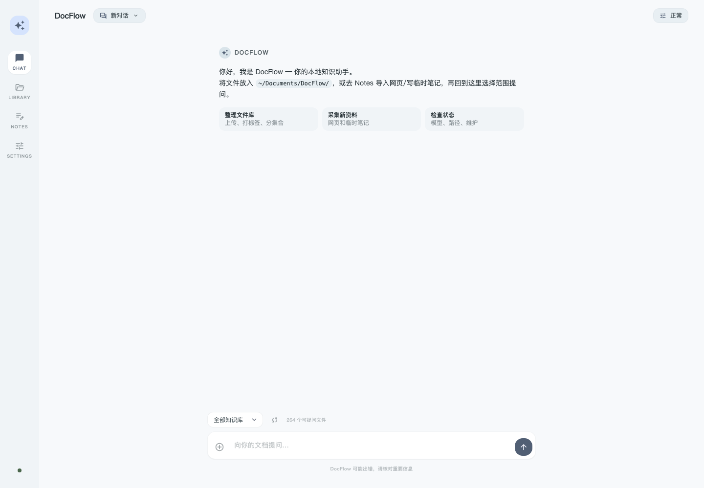
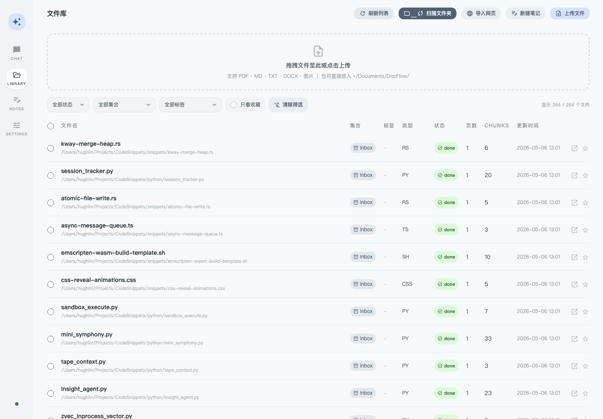

# DocFlow

Local, private document Q&A for PDFs, Markdown notes, Word files, text files, code snippets, and images.

DocFlow watches local folders, parses supported files, indexes them into local search stores, and answers questions from a browser UI. Data stays on the machine.

Current release target: `0.18.0`.

## Product Screenshots





## English

### Project Description

DocFlow is a local-first knowledge assistant. It is designed for personal document collections and Obsidian-style notes: drop files into watched folders, let DocFlow index them, then ask questions with cited answers through the web interface.

The current implementation uses FastAPI, SQLite, Qdrant, local embedding and reranking models, and an MLX-backed local LLM by default.

### Features

- Multi-format ingest: PDF, Markdown, TXT, DOCX, code-like text files, and optional image formats.
- Obsidian-friendly Markdown parsing: frontmatter cleanup, wikilink cleanup, callout cleanup, block-id cleanup, and tag extraction.
- Structured chunking: heading-aware text chunks, table chunks, and table summary chunks.
- Parent context retrieval: small chunks are used for matching, while larger parent context is returned for answer generation.
- Hybrid retrieval: vector search plus SQLite FTS5 keyword search, full-text mode, adaptive routing, and reranking.
- Streaming answers: citations are sent first, followed by token streaming.
- Scoped questions: ask across the full library, one collection, one file, or full-text matches from the Chat view.
- Evidence guard: empty or weak retrieval results return a clear insufficient-evidence answer instead of a confident guess.
- Multi-turn conversations: conversations and messages persist locally, and follow-up questions use recent context.
- Browser conversation controls: create, switch, and delete conversations from the chat header.
- Product workspace shell: Chat, Library, Notes, and Settings are separated into focused daily-use areas.
- Local knowledge capture: import webpages, create quick Markdown notes, save answers back into the local library, and turn source text or selected files into reusable Markdown knowledge outputs.
- Notes workspace: create Markdown notes, import webpages, generate summaries, learning cards, action items, and project briefs, then review recent captured knowledge.
- Safer daily use: long model-backed actions have bounded waits, model switching keeps the previous model if the new one cannot be loaded, and destructive actions require in-app confirmation.
- Foreground priority: background ingest pauses while a user-facing model task is active, then resumes automatically.
- Clearer source handling: citations show PDF pages or Markdown sections and can open the source preview.
- Daily-use controls: answer copy/export, grouped dependency status panel, query elapsed time, and visible ingest queue progress.
- Settings view: model status, dependency health, watched folders, history access, and maintenance commands are visible in one place.
- Runtime and recovery guidance: Settings shows core health, model readiness, OCR/VLM status, and safe copyable repair or dry-run commands.
- Local production styles: the browser UI serves committed CSS from `frontend/styles.css`; it no longer depends on the Tailwind CDN at runtime.
- Library management: collections, user tags, status/favorite filters, batch favorite, batch metadata updates, and batch index rebuild from the Library view.
- Local model options: Qwen3 embedding, Qwen3 reranker, MLX LLM, optional Ollama OCR, optional VLM image parsing.
- Phase 11 maturity baseline: score the project against the 9-point maturity target and run fixed retrieval evidence checks.
- Folder watching: multiple watched directories, recursive scans, debounce, and startup cleanup for deleted files.
- Ingest queue visibility: queue status includes current stage and chunk progress.
- One-command startup: startup checks Python dependencies, SQLite, Qdrant, Ollama, and the app port before launching.
- macOS background service: run DocFlow after login through launchd, with commands to install, inspect, or remove the service.
- Query history, scoped query, favorites, file upload, webpage import, note creation, source listing, file preview, and summary export endpoints.

### Current Product Facts

- Supported ingest formats include PDF, Markdown, DOCX, TXT, code text, and images.
- Scanned PDF OCR uses `glm-ocr`; optional image understanding uses VLM with Qwen3-VL.
- Chat scope controls include full library, one collection, one file, and full-text mode.
- Weak evidence behavior: when evidence is too weak or material is insufficient, DocFlow says the answer cannot be grounded instead of guessing.
- Source handling: answers show citations, PDF page numbers, Markdown sections, and source previews.
- Retrieval debugging uses `/api/debug/retrieve`, including router decisions, candidate stages, and `reranked` results.
- Health checks separate core capabilities from optional capabilities; missing optional capabilities can show `degraded` without marking core query or ingest as broken.
- Settings shows model status, dependency health, watched folders, maintenance commands, model readiness, OCR, and VLM status.
- Recovery guidance includes safe checks, backup preview, repair suggestions, and copyable commands; the browser displays them and does not auto-run them.
- Foreground model work pauses background ingest, then resumes it after the user-facing task finishes.
- Notes can generate Knowledge Outputs: summaries, learning cards, action items, and project briefs.

### Requirements

- Apple Silicon Mac.
- Python 3.11 or newer.
- Docker Desktop for Qdrant.
- Optional Node.js 20+ only when rebuilding the browser CSS after UI changes.
- Optional Ollama for OCR on scanned PDFs and contextual-prefix generation.
- Optional extra packages for DOCX and image ingest: `python-docx`, `mlx-vlm`, `Pillow`, `pillow-heif`.

### Quick Start

Install Python dependencies:

```bash
cd ~/Projects/docflow
python -m venv .venv
source .venv/bin/activate
pip install -r requirements.txt
```

Install optional format support when needed:

```bash
pip install python-docx mlx-vlm Pillow pillow-heif
```

Pull the OCR model when scanned PDF OCR is needed:

```bash
ollama pull glm-ocr
```

The committed browser CSS is enough to run the app. Rebuild it only after UI style changes:

```bash
npm install
npm run build:css
```

Check local dependencies:

```bash
python main.py doctor
```

Start the app:

```bash
python main.py start
```

`python main.py start` checks the local setup, tries to start an existing `qdrant` Docker container when Qdrant is down, prints any remaining action items, and then opens the service at `http://localhost:8000`. If the Qdrant container does not exist yet, create it once:

```bash
docker run -d --name qdrant -p 6333:6333 qdrant/qdrant
```

Recommended daily use on macOS:

```bash
python main.py service status
```

On this machine, DocFlow has been installed as a launchd background service. It runs `python main.py start` from this project and serves `http://localhost:8000` after login. Use `python main.py service status` to check it, and `python main.py service uninstall` if you want to remove it.

Manual service setup commands:

```bash
python main.py service install --dry-run
python main.py service install
python main.py service uninstall
```

Use `--dry-run` first on a new machine to inspect the planned plist and launchctl commands before changing local login services.

Useful commands:

```bash
python main.py doctor --json
python main.py start --check-only
python main.py service status
python main.py service install --dry-run
python main.py scan
python main.py ingest /path/to/file.pdf
python main.py benchmark README.md docs/HANDOFF-v3.md
python main.py eval
python main.py maturity-eval --no-rerank
python main.py check
python main.py rebuild --dry-run
python main.py rebuild --qdrant-only --dry-run
python main.py backup --dry-run
python main.py export-chunks --output backups/chunks.jsonl
python main.py restore-plan backups/docflow-backup-YYYYmmdd-HHMMSS-ffffff.tar.gz
npm run build:css
```

### Configuration

Configuration lives in `config.yaml`.

Important settings:

- `paths.watch_dirs`: folders DocFlow scans and watches.
- `paths.supported_extensions`: extensions accepted by the ingest pipeline.
- `paths.db_path`: SQLite database path.
- `qdrant.host`, `qdrant.port`, `qdrant.collection`: Qdrant connection and collection.
- `embedding.model`, `embedding.backend`, `embedding.device`: embedding model and runtime.
- `chunking.chunk_size`, `chunking.chunk_overlap`: chunk size and overlap.
- `ingest.parent_context_chars`: maximum parent context size used when grouping adjacent chunks.
- `ingest.contextual_prefix`: optional contextual prefix generation for Markdown and table chunks. It is off by default.
- `ingest.contextual_prefix_mode`: `metadata` for deterministic local prefixes, or `ollama` for Ollama-generated prefixes.
- `llm.backend`: answer-generation backend. The current default is `mlx`.
- `vlm.enabled`: enables or disables image parsing.

Current default watched folders:

```yaml
paths:
  watch_dirs:
    - path: "~/Documents/DocFlow"
      recursive: false
    - path: "~/MyNotes/HughLin"
      recursive: true
      extensions: [".md"]
    - path: "~/Projects/CodeSnippets"
      recursive: true
      extensions: [".md", ".py", ".rs", ".ts", ".css", ".sh"]
```

### API Reference

Main endpoints:

| Endpoint | Method | Purpose |
|---|---:|---|
| `/api/query` | POST | Synchronous Q&A |
| `/api/query/stream` | POST | Streaming Q&A |
| `/api/conversations` | GET, POST | List or create conversations |
| `/api/conversations/{id}/messages` | GET | List conversation messages |
| `/api/conversations/{id}` | DELETE | Delete a conversation |
| `/api/ingest` | POST | Trigger scan of watched folders |
| `/api/queue` | GET | Ingest queue status |
| `/api/files` | GET | Indexed file list |
| `/api/upload` | POST | Upload a file into the first watched folder |
| `/api/file/{id}/preview` | GET | Preview the original file |
| `/api/file/{id}/preview` | HEAD | Check preview availability, content type, and size |
| `/api/file/{id}/chunks` | GET | Debug chunk list for one file |
| `/api/history` | GET, DELETE | Query history |
| `/api/history/search` | GET | Search query history |
| `/api/favorites` | GET | Favorite files |
| `/api/favorites/{id}` | POST | Toggle a favorite |
| `/api/summarize` | POST | Export file summaries as Markdown |
| `/api/knowledge-output` | POST | Generate and save reusable Markdown knowledge outputs |
| `/api/debug/retrieve` | POST | Debug retrieval pipeline without answer generation |
| `/api/llm` | GET, POST | View or switch the active LLM |
| `/api/sources` | GET | Watched source folders |
| `/api/health` | GET | Dependency and capability health |

`/api/health` returns `ok`, `degraded`, or `unavailable`. The browser displays this as grouped core, model runtime, and optional capability status. SQLite and Qdrant are critical checks. The live API uses a lightweight SQLite read/write check so background indexing does not trigger false integrity failures; use `python main.py doctor --strict` when a full SQLite integrity check is needed. Ollama, enhanced local models, VLM image parsing, and contextual-prefix support are reported as optional capabilities, so a missing image model can show the app as degraded while core query and ingest remain available. The response also includes safe recommended actions such as `python main.py check --json`, `python main.py backup --dry-run`, `ollama pull glm-ocr`, or model-cache preparation guidance. The browser only displays and copies these commands; it does not auto-run repair actions.

Model-backed API work uses a bounded foreground task runner. If a query, summary, debug retrieval, or model switch times out, the API returns a clear timeout error and the next request can use a fresh worker instead of waiting behind a stuck task. While foreground model work is active, the background ingest queue pauses and `/api/queue` reports the pause state.

`/api/debug/retrieve` includes the router decision, candidate counts, retrieval stages, reranked results, parent-expanded context, and any degraded retrieval stages. If vector search is unavailable, DocFlow can still return FTS results from SQLite. If reranking fails, it returns the fused candidates instead of dropping all results. If answer generation fails after retrieval succeeds, the query response keeps the retrieved snippets and clearly says the answer model is unavailable.

### Development and Testing

Run the test suite:

```bash
cd ~/Projects/docflow
.venv/bin/python -m pytest
```

Run a dry-run ingest benchmark:

```bash
.venv/bin/python main.py benchmark README.md docs/HANDOFF-v3.md
```

Run the fixed retrieval evaluation set:

```bash
.venv/bin/python main.py eval --cases eval/phase11_questions.jsonl --no-rerank --refresh-sources
.venv/bin/python main.py eval --cases eval/phase11_questions.jsonl --no-rerank --refresh-sources --source-filter
```

The unfiltered command keeps whole-corpus retrieval competition visible. The
source-filtered command checks whether the expected project source files contain
enough evidence for every fixed case.

Run the Phase 11 maturity baseline:

```bash
.venv/bin/python main.py maturity-eval --no-rerank --refresh-sources --source-filter
```

Run the generated real sample suite:

```bash
.venv/bin/python main.py sample-suite
```

Check SQLite and Qdrant consistency:

```bash
.venv/bin/python main.py doctor
.venv/bin/python main.py start --check-only
.venv/bin/python main.py service install --dry-run
.venv/bin/python main.py check
.venv/bin/python main.py check --json
```

Plan or run index rebuilds:

```bash
.venv/bin/python main.py rebuild --dry-run
.venv/bin/python main.py rebuild
.venv/bin/python main.py rebuild --qdrant-only --dry-run
.venv/bin/python main.py rebuild --qdrant-only
```

Create a backup archive, export chunks, or inspect a restore plan:

```bash
.venv/bin/python main.py backup --output backups --keep 5
.venv/bin/python main.py export-chunks --output backups/chunks.jsonl
.venv/bin/python main.py restore-plan backups/docflow-backup-YYYYmmdd-HHMMSS-ffffff.tar.gz
```

Rebuild the committed browser CSS after changing Tailwind classes or theme tokens:

```bash
npm install
npm run build:css
```

Check the FTS tables:

```bash
sqlite3 docflow.db "SELECT COUNT(*) FROM chunks_fts;"
sqlite3 docflow.db "SELECT * FROM chunks_fts WHERE chunks_fts MATCH '机器学习' LIMIT 3;"
```

### Project Structure

```text
docflow/
├── config.yaml
├── main.py
├── requirements.txt
├── README.md
├── LICENSE
├── CHANGELOG.md
├── package.json
├── package-lock.json
├── tailwind.config.js
├── frontend/
│   ├── favicon.svg
│   ├── styles.css
│   ├── tailwind.css
│   └── index.html
├── scripts/
│   ├── service.sh
│   └── start.sh
├── src/
│   ├── api/
│   │   ├── app.py
│   │   └── model_tasks.py
│   ├── ingest/
│   │   ├── chunker.py
│   │   ├── embedder.py
│   │   ├── parsers/
│   │   ├── pdf_analyzer.py
│   │   ├── pipeline.py
│   │   ├── queue.py
│   │   ├── store.py
│   │   └── watcher.py
│   ├── maintenance/
│   │   ├── backup.py
│   │   ├── consistency.py
│   │   ├── launchd.py
│   │   └── startup.py
│   ├── query/
│   │   ├── engine.py
│   │   ├── generator.py
│   │   └── retriever.py
│   └── embedding_backend.py
└── tests/
```

### Skill Catalog

This repository does not define Codex skills. The project is a standalone local application.

### Release and Local Deployment

- Local deployment guide: `docs/LOCAL_DEPLOYMENT.md`.
- Final Phase 18 acceptance report: `docs/phase18-final-acceptance.md`.
- Phase 18 handoff: `docs/phase18-handoff.md`.
- Changelog: `CHANGELOG.md`.
- License: `LICENSE`.

External network use is visible and limited to setup or optional runtime dependencies: dependency installation, model downloads, and Ollama access. The browser UI serves its styles and icons locally; it no longer loads Tailwind or icon fonts from runtime CDNs.

### Contributing

Before changing behavior, read `config.yaml`, the relevant files under `src/`, and the tests that cover the area being changed. Keep README commands aligned with real entry points in `main.py`.

Run the tests before handing off changes:

```bash
.venv/bin/python -m pytest
```

### Maintenance Guide

Keep these constraints in mind when changing the project:

- MLX reranker and MLX LLM work should stay serialized through the shared inference executor.
- User-facing model work should stay bounded by the foreground task runner so one stuck action cannot block later requests permanently.
- Ingest and query must use the same embedding backend configuration.
- Background ingest should keep yielding to active foreground model work.
- The ingest pipeline and retriever share one embedding model instance after startup warmup.
- SQLite FTS row IDs are tied to `chunks.id`; update FTS through the store layer.
- Recursive scans intentionally skip `.obsidian/`, `.trash/`, and `.git/`.

### License

MIT. See `LICENSE`.

## 简体中文

### 项目说明

DocFlow 是一个本地优先的文档问答助手，面向个人文档库和 Obsidian 笔记。你把文件放进监控目录，DocFlow 自动解析和索引，然后可以在浏览器里提问，并得到带来源的回答。

当前实现使用 FastAPI、SQLite、Qdrant、本地向量模型、本地精排模型，以及默认的 MLX 本地大模型。

当前发布目标：`0.18.0`。

### 功能特性

- 多格式入库：PDF、Markdown、TXT、DOCX、代码类文本文件，以及可选图片格式。
- 适配 Obsidian 笔记：清理 frontmatter、wikilink、callout、block id，并提取标签。
- 结构化分块：支持按标题分块、表格分块、表格摘要分块。
- 父级上下文检索：用小块命中问题，再把更完整的上下文交给回答模型。
- 混合检索：向量检索加 SQLite FTS5 全文检索，支持全文模式，自动调整候选数量，再做精排。
- 流式回答：先返回引用来源，再逐步返回答案内容。
- 范围提问：Chat 页面支持全部知识库、指定集合、指定文件和全文模式。
- 证据保护：没有命中或证据太弱时，会明确提示资料不足，不会强行编答案。
- 多轮对话：本地保存对话和消息，追问会结合最近上下文。
- 页面内对话管理：可以在聊天页新建、切换和删除对话。
- 产品级工作台：Chat、Library、Notes、Settings 分成四个清晰入口。
- 本地知识采集：支持导入网页、新建临时 Markdown 笔记、把回答保存回本地文件库，并把资料或选中文件生成可复用 Markdown 知识产物。
- Notes 工作区：集中创建 Markdown 笔记、导入网页，生成总结、学习卡片、行动项、项目简报，并查看最近采集内容。
- 更安全的日常使用：长时间模型任务有等待上限，模型切换失败时保留原模型，清空历史和删除对话需要页面内确认。
- 前台优先：用户正在提问、摘要或调试检索时，后台入库会暂停，任务结束后自动恢复。
- 引用来源更清楚：PDF 显示页码，Markdown 显示章节，并可打开来源预览。
- 日用控件：答案复制/导出、分组依赖状态面板、查询耗时和入库队列进度。
- Settings 页面：集中展示模型状态、依赖健康、监控目录、历史入口和维护命令。
- 运行和恢复建议：Settings 会展示核心健康、模型就绪、OCR/VLM 状态，以及可复制的安全检查、备份预览和修复建议。
- 本地生产样式：浏览器页面直接加载 `frontend/styles.css`，运行时不再依赖 Tailwind CDN。
- 文件库管理：Library 页面支持集合、用户标签、状态/收藏筛选、批量收藏、批量更新元数据和批量重建索引。
- 本地模型：Qwen3 embedding、Qwen3 reranker、MLX LLM，可选 Ollama OCR 和 Qwen3-VL 图片理解模型。
- Phase 11 成熟度基线：按照 9 分成熟版目标评分，并运行固定检索证据评测。
- 文件夹监控：支持多个目录、递归扫描、延迟去重，以及启动时清理已删除文件。
- 入库队列可见：可以看到当前阶段和 chunk 处理进度。
- 一键启动：启动前检查 Python 依赖、SQLite、Qdrant、Ollama 和应用端口。
- macOS 后台服务：通过 launchd 登录后自动运行 DocFlow，并提供安装、查看和移除命令。
- 已有接口覆盖查询历史、范围提问、收藏、上传、网页导入、笔记创建、来源列表、文件预览和摘要导出。

### 当前产品事实速查

- 支持入库格式包括 PDF、Markdown、DOCX、TXT、代码文本和图片。
- 扫描版 PDF 的 OCR 使用 `glm-ocr`；可选图片理解使用 VLM 和 Qwen3-VL。
- Chat 页面提问范围包括全部知识库、指定集合、指定文件和全文模式。
- 证据保护：资料不足或证据太弱时，DocFlow 会明确说答案无法根据资料确认，不会强行编答案。
- 引用来源支持 PDF 页码、Markdown 章节、引用列表和来源预览。
- 检索调试使用 `/api/debug/retrieve`，展示 router 判断、候选阶段和 `reranked` 结果。
- 健康检查会区分核心能力和可选能力；可选能力缺失时可以显示 `degraded`，但不会把核心问答或入库判坏。
- Settings 页面集中展示模型状态、依赖健康、监控目录、维护命令、模型就绪、OCR 和 VLM 状态。
- 恢复建议包括安全检查、备份预览、修复建议和可复制命令；页面只展示和复制，不会自动执行。
- 前台模型任务运行时会暂停后台入库，用户任务结束后再恢复。
- Notes 工作区可以生成 Knowledge Outputs：总结、学习卡片、行动项和项目简报。

### 环境要求

- Apple Silicon Mac。
- Python 3.11 或更高版本。
- Docker Desktop，用于运行 Qdrant。
- 可选 Node.js 20+，只在修改页面样式后重建 CSS 时需要。
- 可选 Ollama，用于扫描 PDF 的 OCR 和上下文前缀生成。
- DOCX 和图片入库需要额外安装：`python-docx`、`mlx-vlm`、`Pillow`、`pillow-heif`。

### 快速开始

安装 Python 依赖：

```bash
cd ~/Projects/docflow
python -m venv .venv
source .venv/bin/activate
pip install -r requirements.txt
```

按需安装额外格式支持：

```bash
pip install python-docx mlx-vlm Pillow pillow-heif
```

如果需要扫描 PDF OCR，拉取 OCR 模型：

```bash
ollama pull glm-ocr
```

已提交的浏览器 CSS 可以直接运行。只有修改页面样式后才需要重建：

```bash
npm install
npm run build:css
```

检查本机依赖：

```bash
python main.py doctor
```

启动应用：

```bash
python main.py start
```

`python main.py start` 会先检查本机环境；如果 Qdrant 没有运行，会尝试启动已有的 `qdrant` Docker 容器；如果还缺操作，会直接打印出来。服务启动后访问 `http://localhost:8000`。如果还没有创建过 Qdrant 容器，先执行一次：

```bash
docker run -d --name qdrant -p 6333:6333 qdrant/qdrant
```

macOS 日常推荐用法：

```bash
python main.py service status
```

这台机器已经把 DocFlow 安装为 launchd 后台服务。它会从当前项目运行 `python main.py start`，登录后提供 `http://localhost:8000`。平时用 `python main.py service status` 查看状态；如果想移除，用 `python main.py service uninstall`。

手动安装后台服务命令：

```bash
python main.py service install --dry-run
python main.py service install
python main.py service uninstall
```

在新机器上建议先用 `--dry-run` 查看将要写入的 plist 和将要执行的 launchctl 命令，再决定是否安装。

常用命令：

```bash
python main.py doctor --json
python main.py start --check-only
python main.py service status
python main.py service install --dry-run
python main.py scan
python main.py ingest /path/to/file.pdf
python main.py benchmark README.md docs/HANDOFF-v3.md
python main.py eval
python main.py maturity-eval --no-rerank
python main.py check
python main.py rebuild --dry-run
python main.py rebuild --qdrant-only --dry-run
python main.py backup --dry-run
python main.py export-chunks --output backups/chunks.jsonl
python main.py restore-plan backups/docflow-backup-YYYYmmdd-HHMMSS-ffffff.tar.gz
npm run build:css
```

### 配置

配置集中在 `config.yaml`。

重点配置：

- `paths.watch_dirs`：DocFlow 会扫描和监控的目录。
- `paths.supported_extensions`：入库支持的文件扩展名。
- `paths.db_path`：SQLite 数据库位置。
- `qdrant.host`、`qdrant.port`、`qdrant.collection`：Qdrant 连接和集合。
- `embedding.model`、`embedding.backend`、`embedding.device`：向量模型和运行方式。
- `chunking.chunk_size`、`chunking.chunk_overlap`：分块大小和重叠长度。
- `ingest.parent_context_chars`：相邻 chunk 合并为父级上下文时的最大长度。
- `ingest.contextual_prefix`：是否为 Markdown 和表格 chunk 生成上下文前缀，默认关闭。
- `ingest.contextual_prefix_mode`：`metadata` 表示使用本地固定前缀，`ollama` 表示使用 Ollama 生成前缀。
- `llm.backend`：回答生成方式。当前默认是 `mlx`。
- `vlm.enabled`：是否启用图片解析。

当前默认监控目录：

```yaml
paths:
  watch_dirs:
    - path: "~/Documents/DocFlow"
      recursive: false
    - path: "~/MyNotes/HughLin"
      recursive: true
      extensions: [".md"]
    - path: "~/Projects/CodeSnippets"
      recursive: true
      extensions: [".md", ".py", ".rs", ".ts", ".css", ".sh"]
```

### API 接口

主要接口：

| 接口 | 方法 | 用途 |
|---|---:|---|
| `/api/query` | POST | 普通问答 |
| `/api/query/stream` | POST | 流式问答 |
| `/api/conversations` | GET, POST | 查看或新建对话 |
| `/api/conversations/{id}/messages` | GET | 查看对话消息 |
| `/api/conversations/{id}` | DELETE | 删除对话 |
| `/api/ingest` | POST | 触发监控目录扫描 |
| `/api/queue` | GET | 入库队列状态 |
| `/api/files` | GET | 已入库文件列表 |
| `/api/upload` | POST | 上传文件到第一个监控目录 |
| `/api/file/{id}/preview` | GET | 预览原始文件 |
| `/api/file/{id}/preview` | HEAD | 检查预览是否可用、文件类型和大小 |
| `/api/file/{id}/chunks` | GET | 调试查看单个文件的切块列表 |
| `/api/history` | GET, DELETE | 查询历史 |
| `/api/history/search` | GET | 搜索查询历史 |
| `/api/favorites` | GET | 收藏文件 |
| `/api/favorites/{id}` | POST | 切换收藏 |
| `/api/summarize` | POST | 导出文件摘要 |
| `/api/knowledge-output` | POST | 生成并保存可复用 Markdown 知识产物 |
| `/api/debug/retrieve` | POST | 调试查看检索链路，不生成回答 |
| `/api/llm` | GET, POST | 查看或切换当前模型 |
| `/api/sources` | GET | 查看监控来源目录 |
| `/api/health` | GET | 依赖和能力健康状态 |

`/api/health` 会返回 `ok`、`degraded` 或 `unavailable`。浏览器会把状态分成核心功能、模型运行时和可选能力展示。SQLite 和 Qdrant 是关键检查；运行中的 API 使用轻量 SQLite 读写检查，避免后台入库时误报索引损坏；如果需要完整 SQLite 检查，使用 `python main.py doctor --strict`。Ollama、增强本地模型、图片理解和上下文前缀作为可选能力展示，所以缺少图片模型时，页面可以显示为 degraded，但核心问答和入库仍然可用。返回结果也会带上安全建议，例如 `python main.py check --json`、`python main.py backup --dry-run`、`ollama pull glm-ocr` 或模型缓存准备说明。页面只展示和复制这些命令，不会自动执行修复操作。

模型相关接口使用有等待上限的前台任务管理。如果问答、摘要、检索调试或模型切换超时，接口会返回明确的超时信息，后续请求会使用新的执行通道，不会一直排在卡住的任务后面。前台模型任务运行时，后台入库队列会暂停，`/api/queue` 会显示暂停状态。

`/api/debug/retrieve` 会返回路由判断、候选数量、各阶段结果、精排结果、父级上下文展开结果，以及是否发生检索降级。向量检索不可用时，DocFlow 仍可从 SQLite 全文检索返回结果；精排失败时，会返回融合后的候选结果，而不是直接丢掉全部结果。如果检索成功但回答模型失败，查询接口会保留已找到的片段，并明确提示回答模型暂时不可用。

### 开发与测试

运行测试：

```bash
cd ~/Projects/docflow
.venv/bin/python -m pytest
```

运行一次不写入索引的入库测试：

```bash
.venv/bin/python main.py benchmark README.md docs/HANDOFF-v3.md
```

运行固定检索评估集：

```bash
.venv/bin/python main.py eval --cases eval/phase11_questions.jsonl --no-rerank --refresh-sources
.venv/bin/python main.py eval --cases eval/phase11_questions.jsonl --no-rerank --refresh-sources --source-filter
```

不带 `--source-filter` 的命令用于观察全库竞争下的真实检索情况；带
`--source-filter` 的命令用于确认预期项目文件本身是否能覆盖固定问题。

运行 Phase 11 成熟度基线：

```bash
.venv/bin/python main.py maturity-eval --no-rerank --refresh-sources --source-filter
```

运行自动生成的真实样本套件：

```bash
.venv/bin/python main.py sample-suite
```

检查 SQLite 和 Qdrant 是否一致：

```bash
.venv/bin/python main.py doctor
.venv/bin/python main.py start --check-only
.venv/bin/python main.py service install --dry-run
.venv/bin/python main.py check
.venv/bin/python main.py check --json
```

预览或执行索引重建：

```bash
.venv/bin/python main.py rebuild --dry-run
.venv/bin/python main.py rebuild
.venv/bin/python main.py rebuild --qdrant-only --dry-run
.venv/bin/python main.py rebuild --qdrant-only
```

创建备份归档、导出 chunk，或查看恢复步骤：

```bash
.venv/bin/python main.py backup --output backups --keep 5
.venv/bin/python main.py export-chunks --output backups/chunks.jsonl
.venv/bin/python main.py restore-plan backups/docflow-backup-YYYYmmdd-HHMMSS-ffffff.tar.gz
```

修改 Tailwind class 或主题配置后，重建已提交的浏览器 CSS：

```bash
npm install
npm run build:css
```

检查全文检索表：

```bash
sqlite3 docflow.db "SELECT COUNT(*) FROM chunks_fts;"
sqlite3 docflow.db "SELECT * FROM chunks_fts WHERE chunks_fts MATCH '机器学习' LIMIT 3;"
```

### 项目结构

```text
docflow/
├── config.yaml
├── main.py
├── requirements.txt
├── README.md
├── LICENSE
├── CHANGELOG.md
├── package.json
├── package-lock.json
├── tailwind.config.js
├── frontend/
│   ├── favicon.svg
│   ├── styles.css
│   ├── tailwind.css
│   └── index.html
├── scripts/
│   ├── service.sh
│   └── start.sh
├── src/
│   ├── api/
│   │   ├── app.py
│   │   └── model_tasks.py
│   ├── ingest/
│   │   ├── chunker.py
│   │   ├── embedder.py
│   │   ├── parsers/
│   │   ├── pdf_analyzer.py
│   │   ├── pipeline.py
│   │   ├── queue.py
│   │   ├── store.py
│   │   └── watcher.py
│   ├── maintenance/
│   │   ├── backup.py
│   │   ├── consistency.py
│   │   ├── launchd.py
│   │   └── startup.py
│   ├── query/
│   │   ├── engine.py
│   │   ├── generator.py
│   │   └── retriever.py
│   └── embedding_backend.py
└── tests/
```

### 技能目录

这个仓库本身没有定义 Codex 技能。它是一个独立运行的本地应用。

### 发布和本地部署

- 本地部署说明：`docs/LOCAL_DEPLOYMENT.md`。
- Phase 18 最终验收报告：`docs/phase18-final-acceptance.md`。
- Phase 18 交接文档：`docs/phase18-handoff.md`。
- 版本记录：`CHANGELOG.md`。
- 许可证：`LICENSE`。

外部网络使用已经明确标出，主要是依赖安装、模型下载和 Ollama 访问。浏览器界面的样式和图标都由本地提供，不再从运行时 CDN 加载 Tailwind 或图标字体。

### 贡献指南

修改行为前，先阅读 `config.yaml`、`src/` 下相关文件，以及覆盖对应功能的测试。README 里的命令要和 `main.py` 里的真实入口保持一致。

交付前运行测试：

```bash
.venv/bin/python -m pytest
```

### 维护指南

修改项目时要注意这些约束：

- MLX 精排和 MLX 回答生成需要通过同一个推理通道串行运行。
- 面向用户的模型任务要继续通过前台任务管理设置等待上限，避免一个卡住的任务长期阻塞后续请求。
- 入库和查询必须使用同一套向量配置。
- 后台入库要继续给前台模型任务让路。
- 启动预热后，入库管线和查询器会共享同一个向量模型实例。
- SQLite 全文检索表和 `chunks.id` 绑定，更新时要走存储层。
- 递归扫描会主动跳过 `.obsidian/`、`.trash/` 和 `.git/`。

### 许可证

MIT。见 `LICENSE`。
