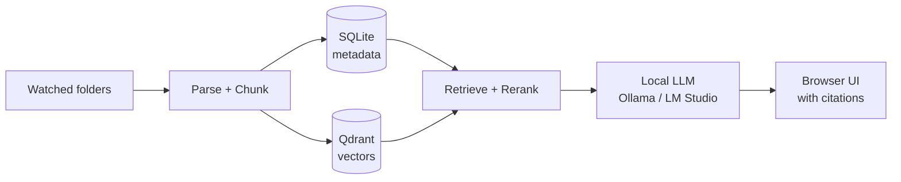

# DocFlow — Drop a folder, ask anything, never leave your laptop

English · [简体中文](README.zh-CN.md)


DocFlow is a fully local RAG assistant. Point it at any folder of PDFs, Markdown, DOCX, code, or images. Ask questions in your browser. Get answers with cited sources.

- **100% offline.** No telemetry, no API keys, no document upload. Verified by `docflow doctor --offline`.
- **Real evaluation, not vibes.** Retrieval Recall@5 = 1.0 on 84 queries, 31/31 parsing eval, 304 unit tests, 73 browser checks — all in repo.
- **Drop-in local models.** Works with Ollama, LM Studio, or any OpenAI-compatible local endpoint.

One command:

```bash
git clone https://github.com/lingengyuan/docflow.git && cd docflow
docker compose up --build
```

Then open <http://localhost:8000> and click **导入示例资料** to try a small local library.

## Why DocFlow

- **vs AnythingLLM** — smaller, no account system, no SaaS fallback paths.
- **vs Khoj** — simpler stack (SQLite + Qdrant), focused on personal documents not chat agents.
- **vs rolling your own LangChain** — already tested. 304 + 73 + 84 + 31 checks shipped.

## How it works



## Features

- Ask questions across PDFs, Markdown, DOCX, TXT, code-like files, and optional image content.
- Review source snippets, save useful answers as notes, and inspect topics, similar files, and knowledge cards.
- Metadata in SQLite, vectors in Qdrant, model traffic local by default.
- Verify behavior end-to-end: unit tests, browser acceptance checks, retrieval eval, parsing eval, and an offline network check.

## Privacy

DocFlow ships with zero telemetry, zero analytics, zero error reporting, and zero document upload. Your documents, SQLite metadata, Qdrant vectors, backups, and indexes all stay on your machine.

```bash
docflow doctor --offline
```

…verifies that nothing is reaching out to the network.

## Project structure

- `main.py` — command entry point
- `src/api/` — browser app and HTTP API
- `src/ingest/` — parsing, chunking, indexing, storage
- `src/query/` — retrieval, reranking, citations, answer generation
- `frontend/` — browser workspace
- `docs/` — public documentation
- `eval/` — committed retrieval and parsing eval inputs

## Configuration

DocFlow generates `config.yaml` from `config.example.yaml` on first run. Configure watched folders, supported extensions, SQLite path, Qdrant connection, embedding model, local model backend, and privacy settings there.

## Development

```bash
python -m venv .venv && source .venv/bin/activate
pip install -e .
docker compose up -d qdrant
docflow demo --create-only
.venv/bin/python -m pytest -q
docflow eval retrieval --refresh-sources --source-filter --write-results
docflow eval parsing --write-results
docflow browser-acceptance
docflow doctor --offline
```

## Contributing

Read [CONTRIBUTING.md](CONTRIBUTING.md). Keep changes focused, run tests before opening a PR, and keep the normal browser UI free of command-line or developer-only wording.

## Documentation

[Features](docs/features.md) · [Architecture](docs/architecture.md) · [Privacy](docs/privacy.md) · [CLI](docs/cli.md) · [Development](docs/development.md) · [Evaluation](docs/evaluation.md)

## License

MIT. See [LICENSE](LICENSE).
