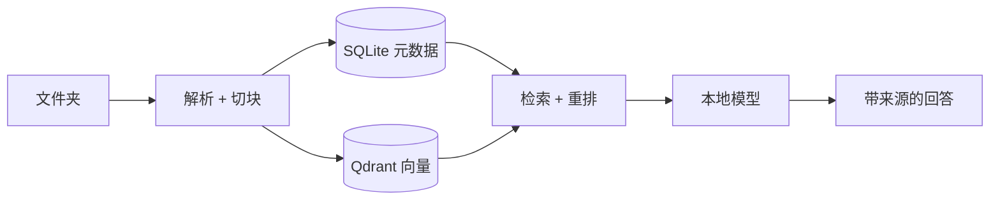

# DocFlow

[English](README.md) · 简体中文

**拖入一个文件夹，直接提问，资料留在本机。**

DocFlow 是一个本地优先的文档问答和个人知识工作台。你可以把 PDF、
Markdown、DOCX、TXT、代码文本和可选图片资料交给它，在浏览器里提问，
查看带来源的回答，并把有用回答保存回自己的本地知识循环里。


README 中的截图来自内置示例资料库，不包含个人文件夹或真实笔记内容。

<table>
  <tr>
    <td><strong>本地优先</strong><br>不包含遥测、分析统计或文档上传。</td>
    <td><strong>回答带来源</strong><br>回答会关联到来源片段和引用位置。</td>
    <td><strong>有验证证据</strong><br>测试、浏览器检查、解析检查和基准结果都有记录。</td>
  </tr>
</table>

## 快速开始

```bash
git clone https://github.com/lingengyuan/docflow.git && cd docflow
docker compose -f docker-compose.image.yml up
```

打开 [http://localhost:8000](http://localhost:8000)，选择示例资料库卡片，
然后点击 **导入示例资料**，就可以体验一个小型本地资料库。

真实问答需要你运行本地模型服务，例如 Ollama、LM Studio，或其他
OpenAI 兼容的本地端点，然后在设置页选择它。Docker 镜像会启动 DocFlow
和 Qdrant；模型权重仍由你选择的本地模型工具管理。

首次运行成本需要提前知道：公开镜像启动路径在当前验证机器上应用基础镜像约
0.5 GB；你选择的本地模型会额外占用空间，常见 7B Ollama 模型通常约 4-5 GB。
图片理解和 Apple Silicon MLX 支持都是可选安装。

## 你能获得什么

- 基于 PDF、Markdown、DOCX、TXT、代码文本和可选图片内容提问。
- 查看来源片段、引用块、来源轨迹、相关资料、主题、知识卡片和活跃概念。
- 把有用回答保存为笔记，并把笔记重新连接到来源资料。
- SQLite 保存元数据，Qdrant 保存向量；选择本地模型时，模型请求留在本机。
- 用测试、浏览器验收、检索评估、解析评估、可信度检查、大库检查和离线网络检查验证行为。

## 本地架构



## 隐私边界

DocFlow 不包含遥测、分析统计、自动错误上报，也不会为了产品分析上传你的文档。
运行时文档、SQLite 元数据、Qdrant 向量、备份和生成索引都会保留在你的机器上，
除非你明确启用外部功能。

```bash
docflow doctor --offline
```

这个命令会检查已覆盖的本地启动、入库、提问、模型状态和来源预览路径，
确认是否存在意外外连。

外部行为是可选且有边界的：网页导入、模型下载和云端模型后端只会在你配置或主动触发后运行。

## 当前验证结果

这些数字用于发布和回归验证，不是大规模公开排行榜成绩。公开可复现检索评估
和源文件过滤后的内部回归检索是两类结果；后者只能用于项目回归，不等同于大规模公开 benchmark。

| 检查项 | 最新结果 | 边界 |
|---|---:|---|
| 单元/集成测试 | `489` 个测试通过 | 本地检查门禁 |
| 浏览器验收 | 82 个检查通过 | 桌面浏览器流程 |
| 公开可复现检索评估 | 547/547 通过 | 已提交公开语料，不是 BEIR/MTEB |
| 外部 BEIR SciFact-lite 子集 | Recall@5 0.95 | 已归档 20 题子集 |
| 外部 BEIR NFCorpus-lite 子集 | Recall@5 0.30 | 已归档 20 题子集，暴露弱项 |
| 解析回归 | 120/120 通过 | Markdown、TXT、PDF、DOCX、噪声文本夹具 |
| 回答可信度夹具 | 14/14 通过 | 确定性来源标记检查 |
| 大库基准 | 1 万份合成资料 | 不测真实模型生成 |
| 离线检查 | 0 个意外外连 | 已覆盖的本地使用路径 |

原始范围、命令和限制见 [评估说明](docs/evaluation.md) 与
[状态说明](docs/status.md)。

## 配置

DocFlow 首次运行会从 `config.example.yaml` 创建 `config.yaml`。监听目录、
支持文件类型、SQLite 路径、Qdrant 连接、Embedding 模型、本地模型后端、
隐私设置和回答质量阈值都在这里配置。

## 开发与测试

```bash
python -m venv .venv && source .venv/bin/activate
pip install -e .
docker compose up -d qdrant
docflow demo --create-only
scripts/run_ci.sh
docflow doctor --offline
```

源码开发时使用 `docker compose up --build`。公开镜像启动使用
`docker-compose.image.yml` 和 `ghcr.io/lingengyuan/docflow:edge`，正式发布会生成版本标签。

评估和发布验证命令见 [评估说明](docs/evaluation.md) 与 [发布说明](docs/release.md)。

## 项目结构

- `main.py`：命令入口。
- `src/api/`：浏览器应用和接口。
- `src/ingest/`：解析、切块、索引和存储。
- `src/query/`：检索、重排、引用和回答生成。
- `frontend/`：浏览器工作台。
- `docs/`：公开文档。
- `eval/`：已提交的检索和解析评估输入。

## 文档

[功能说明](docs/features.md) · [架构说明](docs/architecture.md) ·
[隐私说明](docs/privacy.md) · [威胁模型](docs/threat-model.md) ·
[模型许可](docs/model-licenses.md) · [命令说明](docs/cli.md) ·
[开发说明](docs/development.md) · [评估说明](docs/evaluation.md) ·
[发布说明](docs/release.md) · [状态说明](docs/status.md) ·
[ADR](docs/adr/README.md) · [路线图](ROADMAP.md)

## 贡献指南

请阅读 [CONTRIBUTING.md](CONTRIBUTING.md)。保持改动聚焦，提交前运行测试，
普通浏览器界面不要出现命令行或开发者专用文案。

## 许可证

MIT。见 [LICENSE](LICENSE)。
