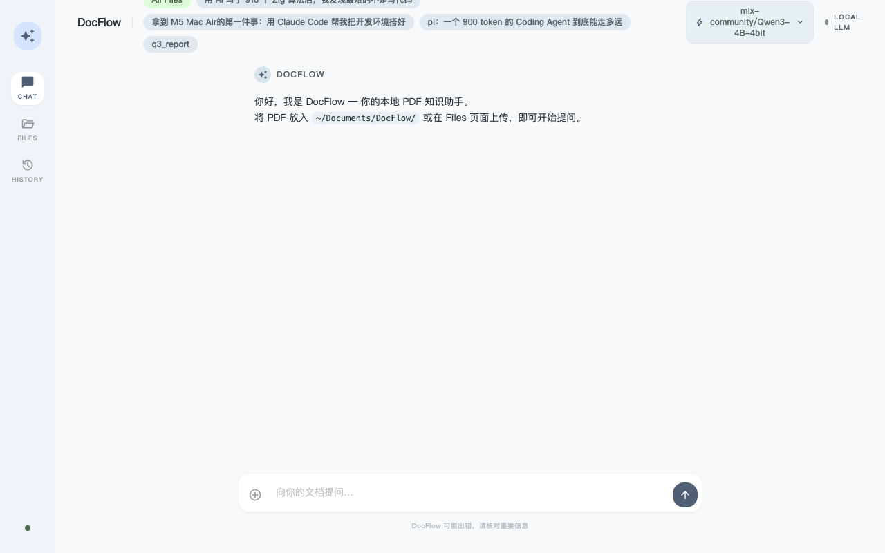
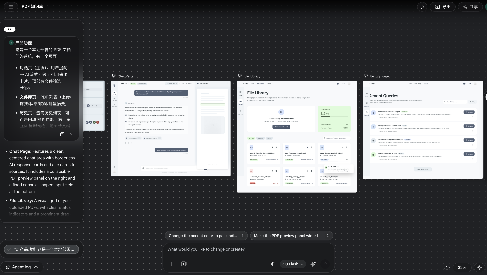
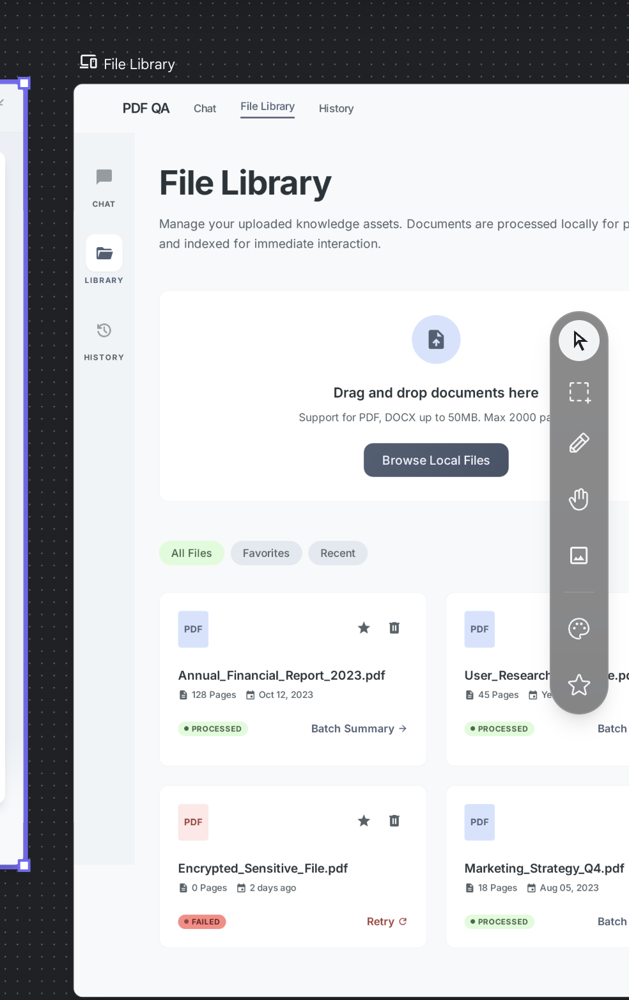
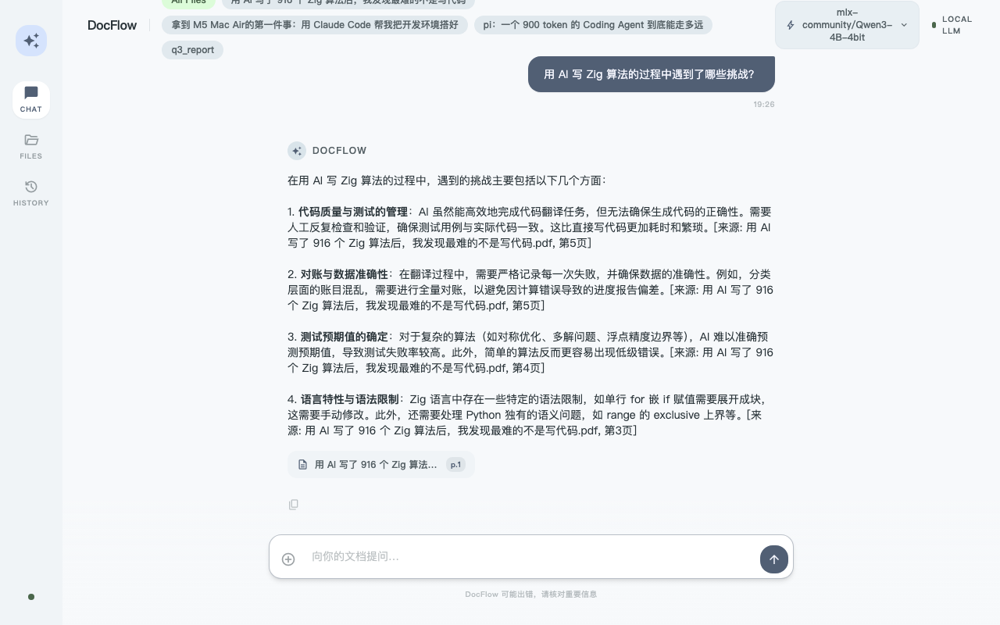
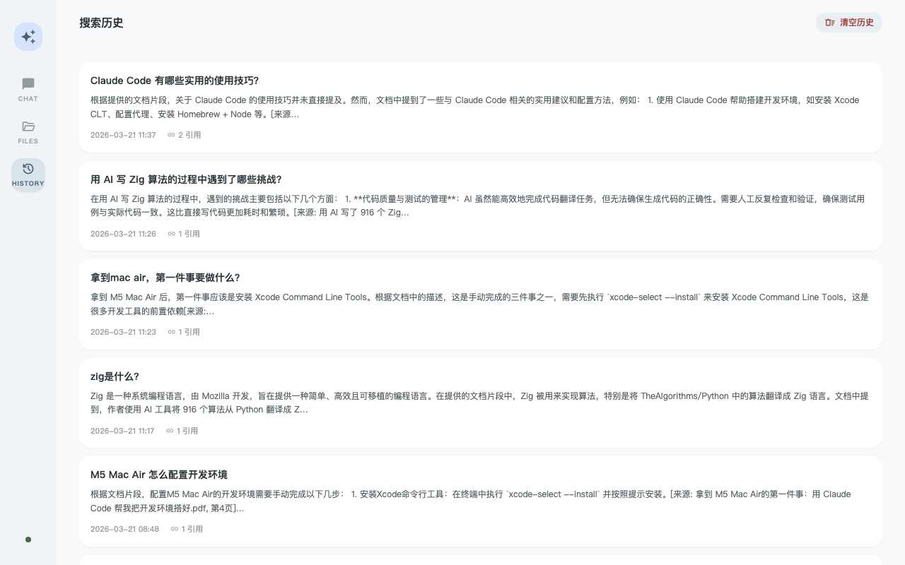
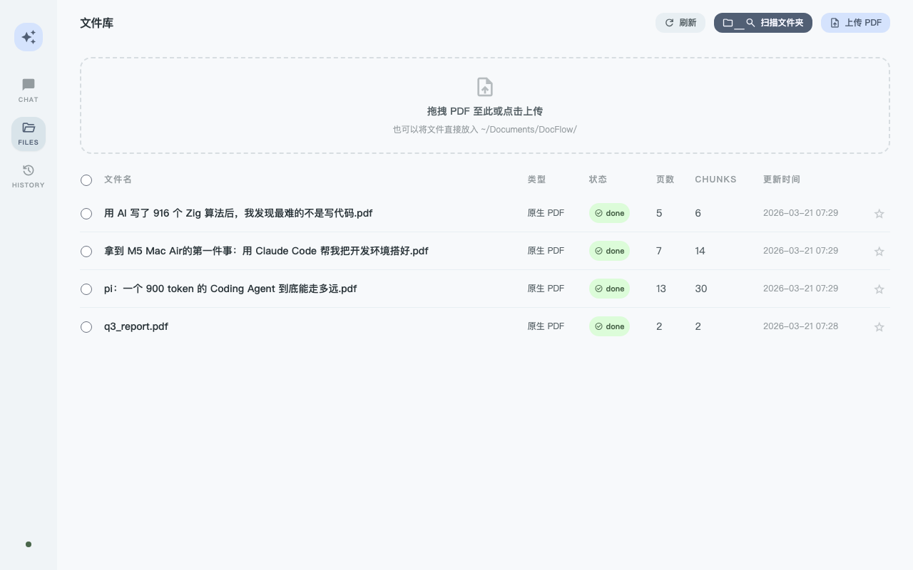

# Python 进程占了 21.5GB 内存，但其实没有——搭本地 RAG 踩的 7 个坑

> **平台**: WeChat 公众号 | **字数**: ~3800字 | **类型**: 洞察型 | **状态**: Draft

---

Activity Monitor 里，我的 Python 服务占了 21.5GB 内存。M5 Mac 总共才 32GB。但服务完全正常，也没有变慢。

花了一个下午才搞清楚为什么。

---

## 为什么要做这个

拿到 M5 Mac Air 之后，第一件事是把开发环境搭好。搭的过程里顺手写了一篇文章，里面有大量安装命令和配置细节。过了两周，我完全不记得当时装了什么、改了哪里。

这件事让我想做一个能查自己文档的东西。把 PDF 扔进去，用中文提问，答案带引用、带页码。完全本地，数据不出机器。

时间点也刚好。最近两件事让这个想法变得可行：

一是 **GLM-OCR** 最近很火。智谱做的 OCR 模型，可以通过 Ollama 本地跑，对中文扫描件的识别效果相当好。这解决了我的一个顾虑——我有一些文档是扫描件，普通 PDF 解析拿不到文字。

二是 **阿里的 Qwen3 系列**。Embedding、Reranker、语言模型，一套都齐了，而且都有 0.6B 的轻量版本，M5 Mac 完全跑得动。这是整个系统的骨架。

于是就做了，叫 DocFlow。



问问题，先返回引用来源（文件名 + 页码），再流式输出回答。整个过程踩了 7 个坑。

---

## Python 进程说它用了 21.5GB 内存，但其实没有

先用两个命令确认：

```bash
vmmap <PID> | grep "Physical footprint"
# → Physical footprint: 21.5G

ps -o rss= -p <PID>
# → 73792   ← 约 72MB
```

RSS 72MB，Physical Footprint 21.5GB，差了 300 倍。

继续挖：

```bash
vmmap <PID> | grep "IOAccelerator" | wc -l
# → 9014
```

进程里有 **9014 个 Metal IOAccelerator 内存区段**。这是 GPU kernel 的编译缓存。

原因在于 Apple Silicon 的统一内存架构——CPU 和 GPU 共享同一块物理内存。`Physical Footprint` 包含了进程在 GPU 侧分配的所有统一内存，不是"Python 在吃 21.5GB RAM"。

具体触发原因是：DocFlow 同时加载了两套 Metal 运行时。Embedding 模型用的是 PyTorch MPS，Reranker 用的是 MLX。两套运行时各自做 Metal shader JIT 编译，各自维护缓存，互不复用，叠加后撑爆了统一内存的 GPU 侧。

解法是把 Embedding 模型从 MPS 改到 CPU：

```yaml
# config.yaml
embedding:
  device: "cpu"   # 原来是 "mps"
```

Embedding 每次 encode 从 0.1s 增加到 0.3s，完全可接受。Physical Footprint 从 21.5GB 降到 30MB。只保留一套 Metal 运行时（MLX）。

**记住一件事**：在 Apple Silicon 上，Activity Monitor 的内存数字不等于"Python 在用多少内存"。用 `vmmap` + `grep Physical footprint` 才是真实数字。

解决完内存问题，服务看起来正常了。但我很快发现另一件事——提问根本没有返回结果。

---

## 向量全是零，Qdrant 里存了 52 个零向量

这个 bug 调了很久，因为表面现象太具误导性。

现象是：上传 PDF 成功，状态显示 `done`，但提问没有任何结果。直接查 Qdrant 里存的向量：

```python
records = client.scroll(collection_name='docflow', limit=5, with_vectors=True)
for r in records:
    v = np.array(r.vector)
    print(np.linalg.norm(v))
# → 0.0000, 0.0000, 0.0000 ...
```

52 个向量，全是零向量。

但单独测 SentenceTransformer 完全正常，norm ≈ 1.0。问题出在流程的某个环节，不是模型本身。

实际上是两个 bug 嵌套：

**表层 bug**：代码里有这样一段，把 retriever 已经加载好的 embedding 模型实例共享给 ingest pipeline，避免两个实例：

```python
# app.py
pipeline.embedder._model = shared_embed  # 直接赋值给私有属性
```

问题在于，`_model` 是一个带懒加载逻辑的 property。懒加载的 setter 里有一行关键调用：`_ensure_collection()`，负责确认 Qdrant collection 存在。直接给 `_model` 赋值绕过了这个 property，`_ensure_collection` 从未执行，Qdrant collection 不存在。

**深层 bug**：upsert 到不存在的 collection 会返回 404，但这个异常被 `except Exception: pass` 吞掉了，文件状态却照样写成了 `done`。

修复很简单，绕过懒加载的时候手动补上被跳过的步骤：

```python
pipeline.embedder._model = shared_embed
pipeline.embedder._vector_dim = shared_embed.get_sentence_embedding_dimension()
pipeline.embedder._ensure_collection(pipeline.embedder._vector_dim)  # 显式补调
```

教训：直接给私有属性赋值等于跳过了所有初始化逻辑，要手动把跳过的步骤补回来。另外，`except Exception: pass` 加上 `status="done"` 是定时炸弹。

---

## BM25 对中文的召回率是零

DocFlow 用的是混合检索——向量检索 + BM25，最后用 RRF 融合排名。向量那路正常，但 BM25 对中文文档的召回率是零。

原因很直白：BM25 的分词用的是 `text.lower().split()`。

```python
"Zig 算法实现".split()  # → ["Zig", "算法实现"]  # "算法实现"没拆开
"比较算法效率".split()  # → ["比较算法效率"]       # 整句变一个 token
```

查询"算法"无法匹配语料中的"算法实现"，BM25 得分全为 0。

引入 jieba 分词：

```python
import jieba

def _tokenize(text: str) -> list[str]:
    return [t for t in jieba.cut(text.lower()) if t.strip()]
```

需要同时改 embedder（建索引时）和 retriever（查询时）。两侧分词逻辑必须完全一致，任何一侧改了另一侧没跟上，BM25 匹配仍然为零。改完之后要重新 ingest 所有文档，BM25 索引格式变了。

---

## 两个根本不存在的库

BM25 修完之后，下一步是把 Reranker 从 PyTorch MPS 迁到 MLX 加速。开发计划里写了用 `embed-rerank` 这个 PyPI 包：

```bash
pip install embed-rerank
# ERROR: Could not find a version that satisfies the requirement embed-rerank
```

PyPI 上没有这个包。这是 AI 帮我写方案文档时编出来的。

换了个思路，试 `mlx-embeddings`——既然 Embedding 也想跑 MLX，装这个：

```
AttributeError: Qwen2Tokenizer has no attribute batch_encode_plus
```

`mlx-embeddings` 针对的是图像/多模态 embedding 模型，对纯文字 embedding 模型的 tokenizer 接口不兼容。

最终结论：mlx-lm 直接在进程内加载就够了，不需要任何独立服务。

```python
from mlx_lm import load
model, tokenizer = load("Qwen/Qwen3-Reranker-0.6B")
```

少一层 HTTP，延迟更低，部署更简单。现在格局是：

| 任务 | 库 |
|------|----|
| 文字 Embedding | sentence-transformers（CPU） |
| 生成式 Reranker | mlx-lm（MLX/Metal） |
| LLM 生成回答 | mlx-lm（MLX/Metal） |

AI 生成的方案文档里提到的第三方工具，先 `pip show` 确认存在再写进 Roadmap。

---

## Ollama 的 qwen3:4b 思考模式关不掉

这个坑花时间最多，也是最终决定把 LLM 从 Ollama 整体迁走的原因。

把 LLM 切换到 `qwen3:4b` 之后，流式查询卡住了——引用 1.3 秒后返回，然后长时间没有任何 token 输出，前端一片空白。

```bash
curl http://localhost:11434/api/chat \
  -d '{"model":"qwen3:4b","messages":[{"role":"user","content":"hello"}],"stream":true}'
# → 所有 token 出现在 "thinking" 字段，"content" 字段全部为空
```

查模型元信息：

```bash
curl http://localhost:11434/api/show -d '{"name":"qwen3:4b"}' | jq .model_info
# → general.finetune: "Thinking"
# → general.name: "Qwen3-4B-Thinking-2507"
```

Ollama 打包时选的是 Thinking 特化版，不是 HuggingFace 上的原版 Qwen3-4B Instruct。Thinking 特化版的思考模式烤进了权重，任何 API 参数都无法关闭。

试过的方法全部无效：`options: {"think": false}`、自定义 Modelfile、`/no_think` token、raw 模式手注空 think 块。

HuggingFace 原版 Qwen3 是 Hybrid Instruct 模型，通过 tokenizer 的 `apply_chat_template` 可以注入空 think 块：

```python
tokenizer.apply_chat_template(
    messages,
    tokenize=False,
    add_generation_prompt=True,
    enable_thinking=False,  # 注入 <think>\n\n</think>\n\n 前缀
)
```

用 mlx-lm 直接加载 HuggingFace 原版模型，thinking 关掉，问题解决。`ollama pull` 时不一定拿到原版模型，需要看 `general.finetune` 字段确认。

---

## `pip install mlx-lm` 顺带升级了 transformers，Embedding 行为静默变化

安装 mlx-lm 时，transformers 被顺带从 4.57.6 升到 5.3.0。之后 Qwen3-Embedding 的 `default_prompt_name` 变成了 `None`，不再自动附加 query instruction 前缀。

这个变化没有任何报错，只是检索质量悄悄变差——查询侧向量化时少了 instruction 前缀，和文档侧向量的空间不完全对齐。

修复是在 retriever 里手动加前缀：

```python
# retriever.py：encode query 时显式加前缀
instructed_query = f"Instruct: {QUERY_INSTRUCTION}\nQuery: {query}"
query_vec = embed_model.encode([instructed_query], ...)

# embedder.py：encode document 时不加前缀（Qwen3-Embedding 规范如此）
dense_vecs = model.encode(batch_texts, ...)
```

安装任何包之前先检查它会不会顺带升级关键库：`pip install X --dry-run`。`transformers` 大版本升级是高风险操作。

---

## UI 设计：Stitch 出图，Claude Code 落地

7 个坑踩完，系统功能跑通了，但界面是 Claude Code 自由发挥的默认样式——渐变紫色背景，色块深浅不均，每次打开都有点出戏。

我不想花时间手写 CSS，也不想反复描述"我想要什么风格"再让 AI 猜。这时候试了一下 Google 最近出的 **Stitch**。

Stitch 是 Google 新推出的 AI UI 设计工具，可以根据文字描述直接生成完整界面，支持实时调整，导出可直接用的前端代码。我把需求告诉它：浅色主题、简洁、左侧 icon 导航栏、引用来源用小卡片展示、不要渐变色。



几分钟生成了方案。左侧是我的描述和 Stitch 的解读，右侧实时预览 Chat、File Library、History 三个页面的设计稿。整体风格对了，细节再微调：把强调色从蓝色改成更低调的灰蓝，去掉卡片边框，信息密度降一档。



这是 File Library 页面放大后的样子。拖拽上传区、文件状态标签、批量操作——功能点都在，视觉层次也清楚。导出 HTML。

把这份设计稿给 Claude Code，说"按照这个风格重写前端"。Claude Code 读完 HTML，拆解出配色 token、组件结构、交互逻辑，把 DocFlow 的业务逻辑迁进去。整个前端重构花了两个小时不到。

最终效果是现在这个浅色主题：


**Stitch 改变的不是"能不能做出好看的 UI"，而是"做出好看 UI 需要多少时间"。** 以前这个流程是：找设计师或自己学设计 → 出稿 → 走查 → 改稿 → 交给前端。现在是：说清楚你要什么 → 挑方案 → 导出 → 给 Claude Code。

但有一个地方没变：你得知道哪个方案是对的。配色是否克制、信息层级是否清晰、哪些元素该省——这些判断 Stitch 不替你做。执行成本降到接近零，剩下的全是判断。这对独立开发者是好事，对专职设计师的冲击恐怕比很多人预期的要快。

---

## 这些模型用起来怎么样

踩坑是一回事，这套模型组合的实际体验另说。

**GLM-OCR** 是这个项目的惊喜。智谱做的扫描件识别，通过 Ollama 本地跑，对中文文档的识别准确率比我预期高很多。古老的扫描 PDF、表格、手写体旁边的印刷字，都能处理。慢是真的慢——一页大约 3–8 秒，但跑在本地、完全离线，对于个人文档来说够用。

**Qwen3-Embedding-0.6B** 出乎意料地好用。600M 参数，1024 维向量，专门针对中文做了优化。跑在 CPU 上，32GB 内存的 M5 一点压力没有，encode 一个 chunk 约 0.3s。最重要的是它对中文语义的理解很到位——问"算法效率"能匹配到文档里写的"时间复杂度"，这种语义跳跃在英文 embedding 模型上表现差很多。

**Qwen3-Reranker-0.6B** 是整个链路里提升最明显的一环。Reranker 做的事是对初步检索的候选文档重新打分，过滤掉向量相似但语义不相关的结果。用 PyTorch MPS 跑时，10 个候选对的精排要 10.45 秒，几乎不可用。换到 MLX 之后：0.40 秒。**提速 26 倍**，这才让精排变得实际可行。

**Qwen3-4B-4bit（MLX）** 目前是默认 LLM。2.3GB，4bit 量化，M5 Mac 上 TTFT（首 token 延迟）2–4 秒，生成速度约 40 token/秒。关掉 thinking 模式之后，对话流式输出很流畅。回答质量比 qwen2.5:7b 好一个档次，中文表达更自然，引用格式也更稳定。



问题先返回引用来源，再流式输出回答内容。右上角显示当前使用的模型，可以切换。



历史记录会保存每次问答的完整内容和引用，方便回溯。

---

## 跑起来的样子和接下来想做的事



目前是四个 PDF，52 个 chunks。当前性能（warm）：

- 检索总耗时：0.85–1.4s（向量 + BM25 + MLX Reranker）
- LLM 首 token：2–4s（in-process MLX Qwen3-4B-4bit）
- Python 进程 Physical Footprint：30MB

不依赖任何云服务，数据不离开本机。

接下来想做的事挺多。PDF 是最容易解析的格式，但知识实际上存在各种地方：

**图片和截图**。M5 Mac 的截图文件夹里其实存了很多有价值的信息——配置截图、错误信息、流程图。有了视觉模型（比如 GLM-4V），这些也可以被索引和检索。

**Word、Markdown、PPT**。技术文档、会议记录、设计稿，很多不是 PDF。这些格式的解析不复杂，主要是要做好分块策略，表格和标题层级的处理方式不同。

**网页和在线文档**。Notion、飞书文档、GitHub README，这些内容更新频繁，需要增量同步，比本地文件复杂一些。

**本地客户端**。现在 DocFlow 是一个 Web 应用，用浏览器访问。但知识库这类工具，常驻系统托盘、随时唤起会更顺手——就像 Raycast 或 Alfred 那样，一个快捷键呼出，问完就关，不打断工作流。用 Tauri 或 Electron 包一层，可以做到：文件拖进 Dock 图标直接入库、系统托盘常驻、离线状态完全感知不到"服务"的存在。这可能是把 DocFlow 从"能用"变成"好用"最关键的一步。

长远来看，本地知识库不应该只是"PDF 问答"，而是能索引你所有的个人数字资产——只要你愿意把它放进去。RAG 的上限取决于你喂给它的内容质量，而不是模型本身。

---

如果你也在 Apple Silicon 上折腾本地 AI，哪类文档是你最想能直接检索的？

---

## ⚠️ 核查记录

| 内容 | 来源 | 状态 |
|------|------|------|
| Physical Footprint 21.5GB / RSS 72MB | vmmap 实测 | ✅ |
| IOAccelerator 区段数 9014 | vmmap 实测 | ✅ |
| Embedding CPU 后 FP 降至 30MB | vmmap 实测 | ✅ |
| `embed-rerank` PyPI 不存在 | pip install 实测 | ✅ |
| `mlx-embeddings` AttributeError | pip install 实测 | ✅ |
| qwen3:4b general.finetune: "Thinking" | curl Ollama API 实测 | ✅ |
| transformers 4.57.6 → 5.3.0 | pip log 实测 | ✅ |
| enable_thinking=False 有效 | mlx-lm 实测 | ✅ |
| 检索耗时 0.85–1.4s | 服务日志实测 | ✅ |
| Reranker MLX vs MPS：0.40s vs 10.45s | 服务日志实测 | ✅ |
| Qwen3-4B-4bit TTFT 2–4s | 实测 | ✅ |
